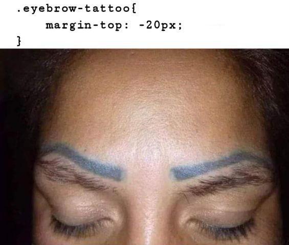

# IT214 / Website Development

## Table of contents
* [General info](#general-info)
* [Technologies](#technologies)
* [Tools & Services](#Tools-&-Services)

## General info
This a collection of project for IT214/WebDev
	
## Technologies
Project is created with:
* Bootstrap 3 or 4
* PHP 5 or 7
* Javascript
* JQuery
* AJAX
* MySQL
* HTML5
* CSS
	
## Tools & Services
Project is created with tools:
* XAMPP
* VSCode
* FontAwesome
* GitHub

